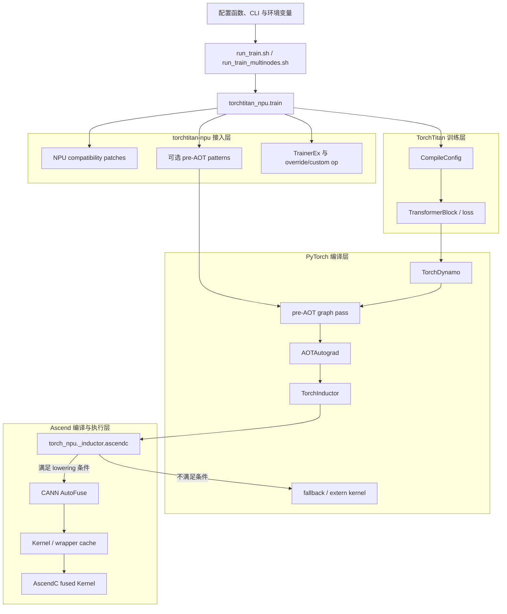

# torch.compile 与 AscendC AutoFuse 特性

本文说明 `torchtitan-npu` 如何复用 PyTorch `torch.compile` 与 TorchInductor，并通过
`torch_npu` 内置的 AscendC Codegen 接入 CANN AutoFuse。文档面向训练配置维护者、模型适配开发者和
融合算子开发者，重点说明启用方式、组件边界及容易被忽略的运行约束。

本文说明 `torchtitan-npu` 通过 TorchTitan 训练入口使用这些能力的方式。GraphTrainer 的整步图捕获和图级
通信优化属于独立编译体系，参见[DeepSeek-V4 GraphTrainer 编译路径适配](./deepseek_v4_graph_trainer.md)。

## 1. 特性背景

PyTorch eager 模式按算子执行模型。训练图中大量 pointwise、reduction、view 和 cast 等小算子会产生重复的
Host 下发和中间 Tensor 读写。`torch.compile` 使用 TorchDynamo 捕获计算，通过 AOTAutograd 构造训练正反向图，
再由 TorchInductor 完成图优化、lowering、调度和代码生成。

`torchtitan-npu` 不重新实现 PyTorch 编译器，而是在 NPU 接入层完成以下工作：

- 复用 TorchTitan 配置选择需要编译的训练组件；
- 选择 `torch_npu` 内置的 AscendC Inductor 后端；
- 提供可选的 pre-AOT graph pattern；
- 在包导入阶段安装当前软件栈需要的 NPU 兼容 patch。

相关机制的边界如下：

| 机制 | 阶段 | 作用 |
| --- | --- | --- |
| TorchTitan compile 配置 | 训练组件构建与并行化 | 选择模型或 loss 是否进入 `torch.compile` |
| AscendC AutoFuse | Inductor lowering 与 Codegen | 自动融合受支持的 Inductor 子图并生成 AscendC Kernel |
| pre-AOT pattern | Dynamo 成图后、AOTAutograd 生成反向前 | 将稳定连续片段替换为专用融合实现 |
| override 与 custom op | 模型构建或明确算子边界 | 替换完整组件，或封装已有 CANN/Triton/PyPTO 算子 |

普通 ATen 图优先交给 AutoFuse；完整组件使用 override；只有稳定且无法由通用融合表达的局部片段才使用
pre-AOT pattern。这样可以保持模型代码与 NPU 后端解耦，避免为同一目标维护多套 wrapper。

## 2. 用户使用场景与对外接口

### 2.1 启用 AscendC AutoFuse

仓库脚本提供最短启用方式：

```bash
TORCHINDUCTOR_NPU_BACKEND=ascendc \
COMPILE_BACKEND=inductor \
bash scripts/run_train.sh <训练参数>
```

也可以直接使用 TorchTitan CLI：

```bash
export TORCHINDUCTOR_NPU_BACKEND=ascendc

bash scripts/run_train.sh \
  --compile.enable \
  --compile.components model,loss \
  --compile.backend inductor \
  <训练参数>
```

多机任务在每个参与节点的启动 shell 中执行同一条命令，`NODE_IPS` 的顺序保持一致：

```bash
source /usr/local/Ascend/cann/set_env.sh
export TORCHINDUCTOR_NPU_BACKEND=ascendc

NODE_IPS=192.168.1.10,192.168.1.11 \
NGPU=16 \
COMPILE_BACKEND=inductor \
bash examples/deepseek_v4/deepseek_v4_flash_cpt_4k_a3.sh \
  --compile.components model,loss \
  --training.steps 5
```

该 wrapper 最终调用 `scripts/run_train_multinodes.sh`；同一节点上的 `torchrun` 子进程会继承启动 shell
的环境变量。需要启用 pre-AOT pattern 时，再增加 `PATTERN_IMPORTS`；如果脚本无法自动识别本机地址，设置
对应的 `LOCAL_HOST`。

### 2.2 使用 `aot_eager` 检查编译兼容性

```bash
COMPILE_BACKEND=aot_eager \
bash scripts/run_train.sh <训练参数>
```

`aot_eager` 可检查 Dynamo、AOTAutograd、FakeTensor 和训练反向是否可用，但不会把完整模型交给 AscendC
AutoFuse。当前 DeepSeek-V4 示例默认使用 `aot_eager`；验证 AutoFuse 功能或性能时，需要显式设置
`COMPILE_BACKEND=inductor`。

含 FlexAttention 的模型在 `aot_eager` 下可能由上游 regional Inductor 单独编译 FlexAttention 区域。
这仍不等同于完整 TransformerBlock 使用 `inductor` 编译。

### 2.3 注册特定图 pattern

当融合目标是 Module 内的一段稳定连续计算时，可以在进程启动前导入 pattern 模块：

```bash
PATTERN_IMPORTS=torchtitan_npu.compile.patterns.deepseek_v4.inplace_partial_rope \
TORCHINDUCTOR_NPU_BACKEND=ascendc \
COMPILE_BACKEND=inductor \
bash scripts/run_train.sh <训练参数>
```

多个模块使用逗号分隔。pattern 修改编译图，`override.imports` 修改配置树和组件，两者是独立入口。
pattern 的开发与验证方法见[片段融合算子接入](../graph_pattern_fusion.md)。

### 2.4 配置和环境变量

本仓直接复用上游 `torchtitan.config.CompileConfig`：

| 字段 | 当前默认值 | 作用 |
| --- | --- | --- |
| `enable` | `False` | 是否启用编译 |
| `components` | `["model", "loss"]` | 选择标准训练路径中的编译组件 |
| `backend` | `"inductor"` | 传给 `torch.compile` 的 Dynamo backend |
| `enable_async_tensor_parallel` | `False` | 是否启用 Inductor Async TP |

当前固定的上游基线实际消费 `model` 和 `loss`。配置中写入其他名称，不代表对应组件已经编译。
`COMPILE_BACKEND` 便捷入口会显式选择 `model`；需要同时编译 loss 时，在脚本末尾追加
`--compile.components model,loss` 覆盖该默认值。

仓库相关环境变量如下：

| 环境变量 | 作用 |
| --- | --- |
| `COMPILE_BACKEND` | 非空时，启动脚本追加 model compile CLI |
| `TORCHINDUCTOR_NPU_BACKEND` | 选择 Inductor 内部的 NPU Codegen |
| `PATTERN_IMPORTS` | `TORCHTITAN_NPU_PATTERN_IMPORTS` 的脚本便捷别名 |
| `TORCHTITAN_NPU_PATTERN_IMPORTS` | 导入并注册以逗号分隔的 pattern 模块 |
| `ASCEND_SET_ENV_PATH` | 指定 CANN `set_env.sh`，未设置时按标准安装路径查找 |

## 3. 特殊背景及限制

### 3.1 存在两级 backend，且必须在导入前确定

`compile.backend=inductor` 选择 PyTorch Dynamo backend；`TORCHINDUCTOR_NPU_BACKEND=ascendc` 选择
Inductor 内部的 NPU Codegen。两者不能互相替代：

```text
torch.compile backend: inductor
              └── NPU Codegen backend: ascendc
```

`torch_npu._inductor` 在导入阶段完成后端注册。环境变量必须在 `import torch` 之前设置；同一进程中先导入框架、
再修改环境变量，不能可靠切换已经初始化的 Codegen。

`scripts/run_train.sh` 在启动 Python 前默认设置 AscendC。当前 `scripts/run_train_multinodes.sh` 不补充该默认值，
多机任务必须在所有节点启动前显式导出同一变量，并确保所有 rank 使用相同 backend 和 pattern 集合。

### 3.2 当前主线使用 `torch_npu` 内置后端

配套 AscendC backend 已随 `torch_npu` 安装到 `torch_npu/_inductor/ascendc`。当前主线不再要求额外安装或
手工导入旧版独立 `inductor_npu_ext`，也不再使用旧的 `npu_bypass_triton_codegen` 方案。

该后端依赖 PyTorch Inductor 内部 API，并调用配套 CANN AutoFuse。PyTorch、`torch_npu`、CANN 和
`torchtitan` 必须按照[软件安装](../user-guides/installation.md)与 [`requirements.txt`](../../requirements.txt)
配套使用，不能只升级其中一个组件后继续复用旧缓存。

### 3.3 标准模型按 Block 编译，并要求完整成图

上游 `torchtitan.distributed.compile.apply_compile` 对每个 TransformerBlock 使用
`compile(..., fullgraph=True)`，而不是默认编译整个 Trainer。Block 内无法被 Dynamo 捕获的 Python 行为会直接
触发编译错误，不会静默拆成多个 Dynamo 图。

Inductor 对已经捕获图内不支持的节点仍可使用 fallback/extern kernel。Dynamo graph break 和 Inductor
fallback 发生在不同阶段，排障时需要区分。

标准编译路径还会启用 `skip_fwd_side_effects_in_bwd_under_checkpoint`。Activation Checkpointing 在反向重算
forward 时，不会重新执行依赖 Python mutation 的副作用。因此，影响正确性的 cache 或状态更新不能只依赖
重算阶段的 Python 副作用；新增状态时应同时审计 eager、AC 重算和 compiled forward。

### 3.4 动态 shape、fallback 和 custom op 均有边界

上游会打开 `capture_scalar_outputs`，用于 token-choice MoE 等数据相关形状；但动态 shape 仍受 Dynamo guard、
数据相关控制流、layout、stride、view、indirect indexing、SoC 和 dtype 支持范围限制。单一静态 shape 编译通过，
不能证明变长序列、packed layout 或不同路由 token 数都能复用同一个融合 Kernel。

训练 custom op 至少需要准确的 dispatcher schema、Fake/Meta 和 Autograd，并保持真实 mutation、alias、shape、
dtype、device 与 layout 语义。`torch.fx.wrap` 只阻止 Python wrapper 被展开，不会自动提供这些契约。

AscendC backend 可以保留不满足 lowering 条件的 fallback 节点。因此训练成功只证明路径可执行，不证明目标区域
已经融合；仍需检查 lowering 日志、Kernel 清单和 profiling。

### 3.5 首次编译、缓存和 profiling 需要隔离

`torch.compile` 使用惰性编译。第一次执行可能包含 Dynamo 捕获、AOTAutograd、Inductor 调度、AutoFuse
Codegen、C++ wrapper 和 AscendC Kernel 编译，不能用于稳态性能结论。

AscendC 融合 Kernel 默认缓存到 `/tmp/.npu_kernels_<user>`，也可通过
`TORCHINDUCTOR_NPU_EXT_CACHE_DIR` 指定。缓存目录依赖文件锁，不能放到无法保证锁语义的跨 OS 共享目录。
切换软件版本、SoC、backend、模型图、shape 关键配置、pattern 或 custom op 后，应使用隔离缓存或定向失效相关
产物；不建议每次训练前无条件清空整个 `/tmp`。

下列调试选项会改变编译或执行行为，不能直接用于正式性能结论：

| 选项 | 影响 |
| --- | --- |
| `TORCHINDUCTOR_FORCE_DISABLE_CACHES=1` | 强制重新编译，增加启动时间 |
| `TORCHINDUCTOR_NPU_EXT_LAYOUT_CHECK=1` | 增加运行时 layout 检查 |
| `ASCEND_LAUNCH_BLOCKING=1` | 改为同步下发，破坏异步执行 |
| `TORCHINDUCTOR_NPU_EXT_DEBUG` | 可能改变 fallback 和融合结构 |
| `TORCHINDUCTOR_NPU_EXT_AUTOTUNE_TOPN` | 增加 PGO 搜索和首次编译成本 |

PGO 首次执行会自行采集 Kernel 性能，不能与外部 profiling 嵌套。需要评估性能时，应先完成编译并保留缓存，
再在后续运行中开启 profiler。调试变量的具体取值随配套 `torch_npu` 演进，应以对应版本手册为准。

## 4. 整体架构



控制流分为三层：TorchTitan 决定编译范围，`torchtitan-npu` 负责 NPU 接入和兼容，`torch_npu`/CANN 负责
实际 lowering、融合和 Kernel 生成。文档中的 `AutoFuse` 特指最后一层的通用自动融合，不包含 override 直接
调用的手写融合算子。

## 5. 核心实现

### 5.1 启动和包初始化

`scripts/run_train.sh` 与 `scripts/run_train_multinodes.sh` 最终通过 `torchrun` 启动
`torchtitan_npu.train`。训练入口复用上游 `torchtitan.train.main`，同时导入 `torchtitan_npu` 触发插件初始化。

包初始化顺序为：

```text
patches → compile → config → extensions → ops
```

该顺序是运行时契约。NPU patch 必须在模型构建和首次编译前生效；AscendC backend 的自有 graph pass 先注册，
仓内 pattern 再追加到已有 pass 链。新增初始化逻辑不能随意调整此顺序。

### 5.2 模型和 loss 编译

标准 DeepSeek/Qwen 模型路径通常遵循：

```text
模型构建与 override
    → TP/EP 等模型内并行变换
    → Activation Checkpointing
    → 逐 TransformerBlock torch.compile
    → FSDP/数据并行包装
```

具体顺序由模型 `parallelize_fn` 决定，新增模型时需要审计实际调用点。GraphTrainer 会采用不同的图捕获和
SimpleFSDP 顺序，不适用上述标准路径。

loss 由上游 `BaseLoss._maybe_compile` 独立检查 `components`，并使用同一个 `compile.backend`。模型编译与 loss
编译互不隐含。

### 5.3 pre-AOT pattern

`torchtitan_npu.compile` 在首次导入时读取 `TORCHTITAN_NPU_PATTERN_IMPORTS`。目标模块调用
`register_pre_aot_patterns`，将具名 `PatternReplacement` 追加到共享 `_PreAOTPatternPass`：

- 保留已经存在的 Inductor custom pass；
- 共享 pass 只安装一次；
- pattern 未命中时保留原图；
- pattern 名称、字面量策略、源码和 closure 参数参与 cache identity。

模型已经编译后再注册 pattern，不会追溯修改已生成的 compiled callable。DeepSeek-V4 partial RoPE 是当前参考
实现，详细的 search/replacement、alias 和梯度约束不在本文重复展开。

### 5.4 AscendC AutoFuse 与 fallback

选择 `ascendc` 后，`torch_npu` 向 Inductor 注册 NPU scheduling、wrapper Codegen、lowering、decomposition
和图优化。后端根据 op、SoC、dtype、shape、stride、layout、数据依赖和 mutation/alias 判断节点能否 lowering
和融合。

满足条件的节点形成融合组，由 CANN AutoFuse 生成 AscendC 图、tiling、Host wrapper 和 device Kernel；
不满足条件的节点保留为 fallback/extern kernel。这部分实现位于 `torch_npu` 和 CANN，本仓只负责选择、接入和
兼容。

### 5.5 NPU 兼容 patch

| Patch | 解决的问题 | 设计边界 |
| --- | --- | --- |
| `patches/workaround/device_copy.py` | non-blocking NPU-to-CPU copy 的 Host 可见性 | 只修正 NPU D2H 和 `prims.device_put`，不把 NPU 全局伪装为 GPU，避免误选 Triton 路径 |
| `patches/torch_npu/inductor_runtime_estimation.py` | 编译期 roofline 估算探测 CUDA/Triton，以及 standalone compile 的 GraphModule 复制路径 | 仅在 NPU 可用时安装；带宽常量只参与调度估算，不代表硬件峰值 |

两个 patch 都依赖包导入时机。CPU-only import 能验证模块可加载，但不能证明 NPU 条件分支已经生效。

### 5.6 与其他组件的交互

| 组件 | 交互约束 |
| --- | --- |
| override | compile 捕获 override 后的真实 `forward`；replacement 必须满足 Fake/Meta、Autograd 和布局语义 |
| 量化训练 | `TrainerEx` 在模型构建前执行编译感知的量化配置转换；量化不会自动启用 compile |
| TP/EP/FSDP | 并行化顺序决定编译边界；标准 CompileConfig 不等于 GraphTrainer 的图内通信调度 |
| Async TP | 要求 compile 已启用、`components` 包含 `model` 且存在 TP mesh |
| 多机训练 | 所有节点必须使用相同软件版本、Codegen backend 和 pattern imports |

## 6. 验证、支持边界与关键文件索引

### 6.1 验证 AutoFuse 是否生效

不能仅以「训练成功」判断融合生效。建议按以下顺序验证：

1. 确认日志出现 `Compiling each TransformerBlock with torch.compile` 或 loss 编译日志；
2. 启用 pattern 时，确认出现 `Pre-AOT pattern ... replaced N subgraph(s)`；
3. 使用 `TORCH_COMPILE_DEBUG=1` 检查 lowered/fallback summary 和编译产物；
4. 用真实输入验证正向、反向、输出和梯度；
5. 通过 profiling 确认真实 `autofused_*` device Kernel 及原生小算子变化；
6. 使用相同 checkpoint、输入、并行配置和随机性比较 loss 与 grad norm；
7. 关闭额外调试开关，在 warmup 后的稳定 step 测量性能。

融合可能改变中间结果物化位置和浮点运算分组。数值验收应区分 bit-wise 一致、容差一致和收敛一致，不能只用
训练是否出现 NaN 作为标准。

### 6.2 当前支持边界

| 能力 | 激活方式 | 当前状态与边界 |
| --- | --- | --- |
| 标准模型编译 | `components` 包含 `model` | 上游按 Block 使用 `fullgraph=True`；具体 shape 受后端覆盖约束 |
| loss 编译 | `components` 包含 `loss` | 独立于模型编译；收益取决于 loss 图规模和 fallback |
| AscendC AutoFuse | `backend=inductor` 且 NPU backend 为 `ascendc` | 实际融合范围由 `torch_npu`、CANN、SoC、dtype、shape 和 layout 决定 |
| `aot_eager` 检查 | `backend=aot_eager` | 可验证成图和正反向，不证明 AutoFuse 性能 |
| pre-AOT pattern | 显式导入 pattern 模块 | 当前提供 DeepSeek-V4 partial RoPE 示例；真实 Kernel 需在配套算子环境验证 |
| GraphTrainer | 选择 `graph_trainer_*` 配置 | 独立特性，不属于本文标准 CompileConfig 路径 |

源码存在某条路径不表示全部设备和并行组合均已验证。发布验证应记录模型、SoC、dtype、序列布局、并行策略和
完整软件版本。

### 6.3 关键文件索引

| 归属 | 文件或模块 | 作用 |
| --- | --- | --- |
| 本仓 | `scripts/run_train.sh` | 单机启动、AscendC 默认 Codegen、compile 和 pattern 参数 |
| 本仓 | `scripts/run_train_multinodes.sh` | 多机启动和 compile 参数；NPU backend 需在各节点显式统一 |
| 本仓 | `torchtitan_npu/train.py` | 复用上游训练入口并触发插件初始化 |
| 本仓 | `torchtitan_npu/__init__.py` | 固定 patches、compile、config、extensions 和 ops 的加载顺序 |
| 本仓 | `torchtitan_npu/compile/__init__.py` | 读取并导入 `TORCHTITAN_NPU_PATTERN_IMPORTS` 指定的 pattern 模块 |
| 本仓 | `torchtitan_npu/compile/pattern_replacement.py` | 共享 pre-AOT pass、注册和 cache identity |
| 本仓 | `torchtitan_npu/patches/workaround/device_copy.py` | NPU 异步 D2H 和 `device_put` 兼容 |
| 本仓 | `torchtitan_npu/patches/torch_npu/inductor_runtime_estimation.py` | NPU runtime estimation 和 standalone compile 兼容 |
| 本仓 | `torchtitan_npu/extensions/trainer.py` | 编译感知的 NPU Trainer 与量化转换 |
| 上游/外部依赖 | `torchtitan.config.CompileConfig`、`torchtitan.distributed.compile` | 标准 compile 配置、Block 编译、Async TP 和 regional Inductor |
| 外部依赖 | `torch_npu._inductor.ascendc` 与 CANN AutoFuse | NPU lowering、融合调度、tiling、Kernel 生成和编译 |

### 6.4 相关文档

- [片段融合算子接入](../graph_pattern_fusion.md)
- [融合算子接入指南](./fused_ops.md)
- [软件安装](../user-guides/installation.md)
